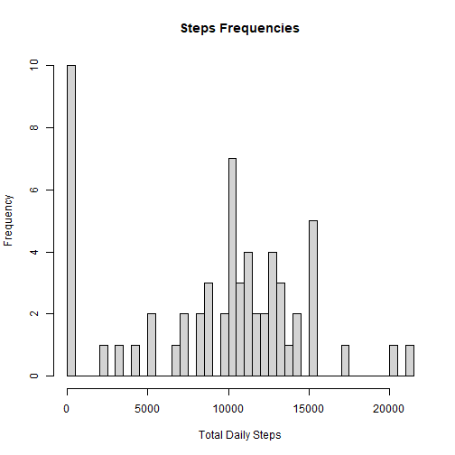
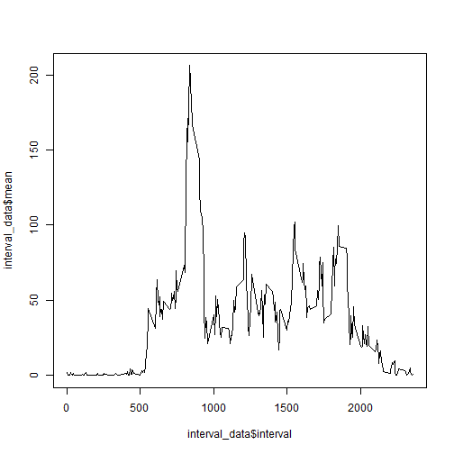
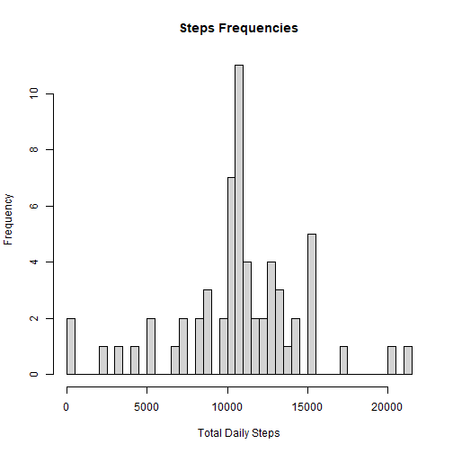
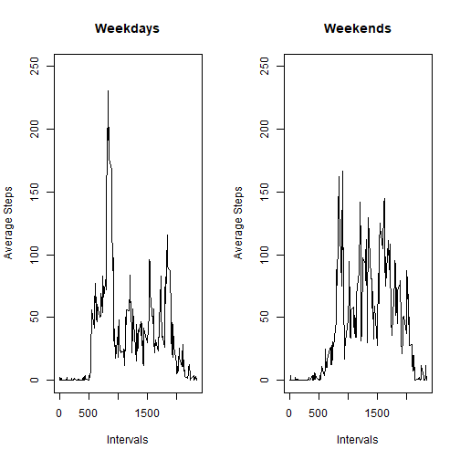

# Physical Activity Data Analysis

Following data consists of steps records of an individual for 61 days.

## Getting Data

You can download the `activity.csv` file from my Github [**Reproducible-Research --- Course-Project-1**](https://github.com/alihsn9776/Reproducible-Research---Course-Project-1) repository. download the file and move it to your work directory.
To use dates, we need to transform the to the proper format.


```r
getwd()
```

```
## [1] "F:/JHU/Reproducible Research"
```

```r
data <- read.csv("activity.csv")
data$date <- as.Date(data$date)
summary(data)
```

```
##      steps             date           
##  Min.   :  0.00   Min.   :2012-10-01  
##  1st Qu.:  0.00   1st Qu.:2012-10-16  
##  Median :  0.00   Median :2012-10-31  
##  Mean   : 37.38   Mean   :2012-10-31  
##  3rd Qu.: 12.00   3rd Qu.:2012-11-15  
##  Max.   :806.00   Max.   :2012-11-30  
##  NA's   :2304                         
##     interval     
##  Min.   :   0.0  
##  1st Qu.: 588.8  
##  Median :1177.5  
##  Mean   :1177.5  
##  3rd Qu.:1766.2  
##  Max.   :2355.0  
## 
```


## Total steps/Day Mean

First we use `sum()` to calculate the total steps for each day and then plot a histogram for the frequencies of total steps.


```r
library(dplyr)
tot_daily_steps <- data %>% 
        group_by(date) %>% 
        summarise(Total = sum(steps, na.rm = TRUE))
head(tot_daily_steps)
```

```
## # A tibble: 6 × 2
##   date       Total
##   <date>     <int>
## 1 2012-10-01     0
## 2 2012-10-02   126
## 3 2012-10-03 11352
## 4 2012-10-04 12116
## 5 2012-10-05 13294
## 6 2012-10-06 15420
```

```r
hist(x = tot_daily_steps$Total, breaks = nrow(tot_daily_steps), freq = TRUE,
     xlab = "Total Daily Steps", main = "Steps Frequencies")
```




## Daily steps mean and median

Then we want to know where the data of each day centered at. So we use `mean()` and `median()` functions.

```r
cent_daily_steps <- data %>% 
        group_by(date) %>% 
        summarise(mean = mean(steps, na.rm = TRUE), median = median(steps, na.rm = TRUE))
head(cent_daily_steps)
```

```
## # A tibble: 6 × 3
##   date          mean median
##   <date>       <dbl>  <dbl>
## 1 2012-10-01 NaN         NA
## 2 2012-10-02   0.438      0
## 3 2012-10-03  39.4        0
## 4 2012-10-04  42.1        0
## 5 2012-10-05  46.2        0
## 6 2012-10-06  53.5        0
```

##
To understand the daily pattern, we will calculate the average steps for each 5 minute interval. then we will plot the average steps for each interval as a time serie.

```r
interval_data <- data %>% 
        group_by(interval) %>% 
        summarise(mean = mean(steps, na.rm = TRUE))
head(interval_data)
```

```
## # A tibble: 6 × 2
##   interval   mean
##      <int>  <dbl>
## 1        0 1.72  
## 2        5 0.340 
## 3       10 0.132 
## 4       15 0.151 
## 5       20 0.0755
## 6       25 2.09
```

```r
plot(x = interval_data$interval, y = interval_data$mean, type = "l")
```



So let's find out the interval wit the most average steps in day and extract its value.


```r
interval_data[interval_data$mean == max(interval_data$mean),]
```

```
## # A tibble: 1 × 2
##   interval  mean
##      <int> <dbl>
## 1      835  206.
```

## Imputing missing values
 
First, Let's find out how many observations are missing.

```r
nrow(data[is.na(data$steps),])
```

```
## [1] 2304
```

We will impute these observations by imputing the average for intervals. Let's save our `data` to a second edition first: `imputed_data` and then apply a for loop with an embedded another for loop! it will find the missing values in `steps` column and then replace the `NA` with the average for the interval. It will take a couple of seconds for R to run this code. As we will see there will be no missing values in our imputed data.


```r
imputed_data <- data
for (i in 1:nrow(imputed_data)) {
        for (j in 1:nrow(interval_data)) {
                if (imputed_data$interval[i]==interval_data$interval[j]) {
                        if (is.na(imputed_data$steps[i])) {
                                imputed_data$steps[i] <- interval_data$mean[j]
                        }
                }
        }
}
nrow(imputed_data[is.na(imputed_data$steps),])
```

```
## [1] 0
```

Let's regenerate the previous histogram, but this time with imputed data. First, we will summarize the total steps in `imput_tot_steps` dataframe and then plot the histogram.


```r
imput_tot_steps <- imputed_data %>%
        group_by(date) %>% 
        summarise(Total = sum(steps))
summary(imput_tot_steps)
```

```
##       date                Total      
##  Min.   :2012-10-01   Min.   :   41  
##  1st Qu.:2012-10-16   1st Qu.: 9819  
##  Median :2012-10-31   Median :10766  
##  Mean   :2012-10-31   Mean   :10766  
##  3rd Qu.:2012-11-15   3rd Qu.:12811  
##  Max.   :2012-11-30   Max.   :21194
```

```r
hist(x = imput_tot_steps$Total, breaks = nrow(imput_tot_steps), freq = TRUE,
     xlab = "Total Daily Steps", main = "Steps Frequencies")
```



As we see, the histogram looks like a bell curve right now.
Let's calculate the new mean and median for each day and figure out whethere there is a difference or not!


```r
cent_imp <- imputed_data %>% group_by(date) %>% summarise(Mean = mean(steps), Median = median(steps))
mean_log <- summary(cent_daily_steps$mean == cent_imp$Mean)
median_log <- summary(cent_daily_steps$median == cent_imp$Median)
cbind(mean_log, median_log)
```

```
##      mean_log  median_log
## Mode "logical" "logical" 
## TRUE "53"      "53"      
## NA's "8"       "8"
```

So we see that except the NA values, other rows are identical.

## Weekdays vs Weekends: comparing the patterns

let's findout the weekdays of each observation and save the output in a new column `day`


```r
imputed_data$day <- weekdays(imputed_data$date, abbreviate = TRUE)
summary(as.factor(imputed_data$day))
```

```
##  Fri  Mon  Sat  Sun  Thu  Tue  Wed 
## 2592 2592 2304 2304 2592 2592 2592
```

Then wee nedd to label them as `weekdays` or `weekends`. So I will define a new column `weekend` and label the days as Yes or No.


```r
imputed_data$weekend <- NA
for (k in 1:nrow(imputed_data)) {
        if (imputed_data$day[k]=="Sat" | 
            imputed_data$day[k] == "Sun") {
                imputed_data$weekend[k] <- "Yes"
        } else {
                imputed_data$weekend[k] <- "No"
        }
        
}
summary(as.factor(imputed_data$weekend))
```

```
##    No   Yes 
## 12960  4608
```

let's plot the interval pattern for weekdays and weekends. First I will define the `imp_interval` dataframe, grouped by both interval and weekends, and calculate the mean for each interval based on weekdays/weekends (weekend = Yes/No). and then I will define two separate dataframes for each level: `imp_interval_wknd` and `imp_interval_wkday`.


```r
imp_interval <- imputed_data %>% group_by(interval, weekend) %>% summarise(Mean = mean(steps))
```

```
## `summarise()` has grouped output by 'interval'. You
## can override using the `.groups` argument.
```

```r
imp_interval_wknd <- imp_interval[imp_interval$weekend == "Yes",]
imp_interval_wkday <- imp_interval[imp_interval$weekend == "No",]
rbind(head(imp_interval_wkday), imp_interval_wknd)
```

```
## # A tibble: 294 × 3
## # Groups:   interval [288]
##    interval weekend   Mean
##       <int> <chr>    <dbl>
##  1        0 No      2.25  
##  2        5 No      0.445 
##  3       10 No      0.173 
##  4       15 No      0.198 
##  5       20 No      0.0990
##  6       25 No      1.59  
##  7        0 Yes     0.215 
##  8        5 Yes     0.0425
##  9       10 Yes     0.0165
## 10       15 Yes     0.0189
## # ℹ 284 more rows
```

Now let's panel the plots for each level


```r
par(mfrow = c(1,2))
plot(x = imp_interval_wkday$interval, y = imp_interval_wkday$Mean, type = "l", main = "Weekdays", ylim = c(0,250), ylab = "Average Steps", xlab = "Intervals", )
plot(x = imp_interval_wknd$interval, y = imp_interval_wknd$Mean, type = "l", main = "Weekends", ylim = c(0,250), ylab = "Average Steps", xlab = "Intervals")
```



Thank You!
